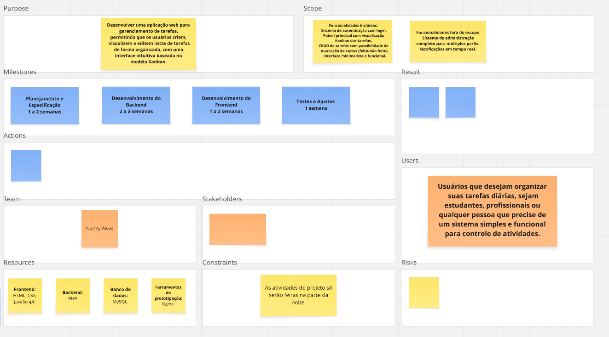
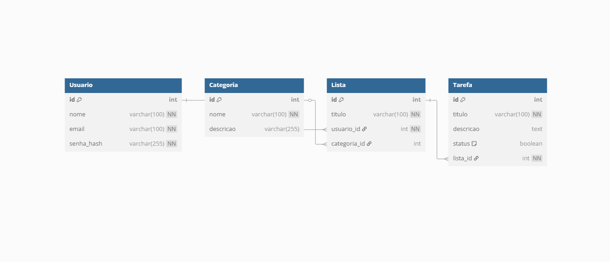

# 📘 Documentação do Projeto - Desenvolvimento Web

---

## 🧾 Visão Geral

Proposta da Aplicação: TO DO LIST

A aplicação TO DO LIST foi desenvolvida para ajudar usuários a organizar e gerenciar tarefas de forma prática e eficiente, oferecendo
a possibilidade de criar, visualizar e controlar listas de afazeres. Cada usuário pode fazer login na plataforma, onde terá acesso a
todas as suas listas e tarefas.

---

## ✅ Backlog

| ID    | Prioridade | História de Usuário                                                                 |
|-------|------------|--------------------------------------------------------------------------------------|
| HU-1  | 1️⃣         | Cadastro de usuários (registro/login) |
| HU-2  | 2️⃣         | Login seguro e autenticação de usuários |
| HU-3  | 3️⃣         | Criação de novas listas de tarefas |
| HU-4  | 4️⃣         | Visualização de todas as listas e tarefas em painel unificado|
| HU-5  | 5️⃣         | Edição de listas e tarefas (alterar título, descrição) |
| HU-6  | 6️⃣         | Marcar tarefa como concluída ou pendente|
| HU-7  | 7️⃣         | Pesquisas das tarefas nas listas |
| HU-8  | 8️⃣         | Criação de categorias personalizadas (trabalho, estudo, etc) |
| HU-9  | 9️⃣         | Interface responsiva e agradável ao usuário final |
---

## 🎨 Protótipo de Telas

As principais funcionalidade descritas no backlog possui ao menos uma tela representando sua interface esperada.

### 🖼️ Protótipo dos Requisitos

**Figura 1**: Protótipo da tela do projeto.

---

## 🏗 Análise e Projeto 

O projeto  do sistema 

### Modelo 

### Autorização  e Autenticação 

Autorização e autenticação feitas por API

🔹 Usuários Autenticados
Criados via cadastro/login na API pública.

Usam token JWT para acesso autenticado.

### Tecnologias a serem utilizadas 
HTML, CSS, MYSQL, VUE, PHP....

---

### Telas do sistema
[FIGMA](https://www.figma.com/design/wEuuOL65TAmJu8FIaXds3n/Figma-basics--Copy-?node-id=1669-162202&m=dev&t=D1iGOLKRFXT7xfVa-1)
